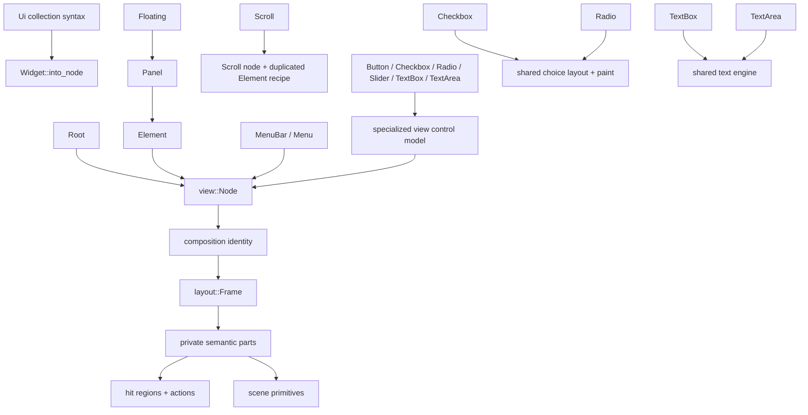

# Widget Grammar Audit — 2026-07-12

This audit asks whether the public widget catalog is a truthful grammar of
reusable semantic pieces or a set of parallel implementations that merely
agree today. The baseline is commit `c89b6c6b` (`Close practiced Constitution
at fixed point`) with a clean worktree and 812 ordinary library tests passing.

## Protocol

The complete catalog, decomposition graph, and cross-phase role matrix precede
any production change. Similar fields or syntax do not authorize a merge.
A consolidation is admissible only when two existing paths express the same
meaning, one existing owner can absorb that meaning, the displaced path can be
deleted, behavior is witnessed, and no public API, feature, visual policy,
accessibility policy, or speculative component system is required.

The audit distinguishes:

- **semantic reuse** — one owner implements one rule for multiple widgets;
- **recipe reuse** — a richer widget delegates construction to a simpler
  public or private recipe while preserving its own meaning;
- **forwarding boilerplate** — repeated ergonomic methods with no repeated
  policy or algorithm;
- **parallel policy** — the same decision is independently implemented and can
  drift;
- **role-specific meaning** — similar-looking code whose behavior is genuinely
  different;
- **missing grammar** — built-ins can express a concept that application-made
  compound widgets cannot obtain from the public pieces.

## Public construction catalog

`Widget` has one operation, `into_node`. `view::Node` itself implements
`Widget`, so direct node construction is the low-level public escape seam.
`widget::view` supplies a `Root`; `widget::view_node` accepts any widget as the
view root. `Ui` is a mutable collection syntax over the same `Widget -> Node`
boundary, not a second retained tree.

| Public item | Construction surface | Node / payload produced | State and binding | Primary whole witnesses |
| --- | --- | --- | --- | --- |
| `Root` | `new`, `child`, `children` | `Role::Root`, children | No app state, focus, or binding | Every `widget::view` journey; root role asserted in `document_editor` |
| `Element` | id/label/subject, dimensions, background, layout, children, trigger | Starts as `Panel`; choosing an axis turns it into `Stack` | Owns declarative layout/style recipe; optional command binding | `widget_layout_tests`, `widget_binding_tests`, `widget_identity_tests` |
| `Panel` | `Element` surface plus trigger | Delegates to `Element(Role::Panel)` | No independent state; recipe composition is real | `widget_layout_tests`, panel paint and focus cases in `layout_scene` |
| `panel::Floating` | panel surface, placement and diagnostic presentation preferences | Delegates `FloatingPanel` through `Panel` and `Element` | Explicit interaction id; overlay identity, no runtime behavior in widget | floating/overlay/native-popup cases in `layout_scene` and `platform_tests` |
| `Scroll` | id/label/subject, dimensions, background, layout, children | `Role::Scroll` with axis/style | Declarative recipe only; runtime offset is projected later | scroll, reveal, clip, scrollbar and wheel journeys in `layout_scene` |
| `MenuBar` | children | `Role::MenuBar` | Open state borrowed from interaction projection | menu sizing/painting/focus journeys in `layout_scene` and `widget_focus_tests` |
| `Menu` | id, label, children | `Role::Menu` | Identity and toggle action; open state borrowed | menu command, keyboard, overlay and native-popup journeys |
| `Binding<C>` | button/menu placement, typed arguments | `Role::Binding` plus typed `view::Binding` | Command metadata resolved later; no widget runtime | `widget_binding_tests`, menu/palette command journeys |
| `Label` | text | `Role::Label` plus node label | Passive; no identity unless callers use direct node surface | layout, typography and paint cases in `widget_layout_tests`/`layout_scene` |
| `Separator` | unit constructor | `Role::Separator` | Passive | menu row layout and `Rule` paint cases in `layout_scene` |
| `Button` | label, reserved labels, typed trigger | `Role::Button` plus `view::Button` | Label/reservation owned; command state borrowed through binding | binding, focus, identity, sizing and scene journeys |
| `Checkbox` | label, checked value, typed trigger | `Role::Checkbox` plus `view::Checkbox` | Checked value supplied by app; interaction state borrowed | choice layout/paint, focus and gallery history journeys |
| `Radio` | label, selected value, typed trigger | `Role::Radio` plus `view::Radio` | Selected value supplied by app; group/exclusivity remains app command policy | choice layout/paint, focus and gallery history journeys |
| `Slider` | label, value/range, fixed or mapped trigger | `Role::Slider` plus normalized `view::Slider` | App value supplied; range normalization owned by view model; gesture/capture borrowed | complete drag, mapping, history, hover and cancellation family in `widget_slider_tests` |
| `TextBox` | text, placeholder, focus, mapped submit | `Role::TextBox` plus `view::TextBox` | App text plus interaction-owned draft/history/preedit/caret projection | full edit/focus/pointer/clipboard/IME family in `widget_text_box_tests` |
| `TextArea` | text, buffer/state, document, id, wrap, focus | `Role::TextArea` plus `view::TextArea` | Buffer/edit state supplied by app/document; scroll/reveal/preedit/caret borrowed | document, text input, host/platform and large layout-scene families |
| `view::Node` | public role constructors and child/style-independent builders | Direct node | Low-level declarative escape seam; still reconciled normally | Used throughout internal and external-style tests |

`Layout`, `Direction`, and `Ui` are public construction vocabulary but do not
implement `Widget`. `SectionHeader` is an internal view role and is included in
the role matrix, not the public widget catalog.

## Primitive ladder

```text
application values and typed commands
  ↓
Widget recipes and Ui collection syntax
  Root / Element / Panel / Floating / Scroll / Menu / controls
  ↓ into_node
view declaration
  Node { Role, Style, Binding, Control, children, identity hints }
  ↓ reconcile / project
retained identity and borrowed interaction facts
  composition::NodeId + projected focus/scroll/drafts/open state
  ↓ derive
layout recipes and semantic subparts
  flow rows, viewport, choice mark+label, slider label+track+thumb,
  text field/area layout, active rects, clips
  ↓ hit / act
interaction targets and view::Action
  command activation, focus, capture, text edit, menu toggle, scrolling
  ↓ paint
scene primitives
  text, quad, rule, pane, clip, groups, caret/selection/scrollbar chrome
```

This is not a system where every complex control is a tree of public widgets.
Built-in controls are semantic leaves in the public view tree; layout and scene
decompose them into private subparts. That is sound when those subparts must be
one atomic focus/identity/action unit. It becomes a grammar deficit when an
application-authored compound control needs the same semantic behavior but can
only reproduce its appearance.

## Decomposition graph



The important healthy examples are `Panel -> Element`, `Floating -> Panel`,
checkbox/radio choice geometry and paint, and both text controls depending on
the independent text engine. `Scroll` currently sits beside `Element` while
repeating its recipe, rather than delegating to it.

## Cross-phase role matrix

The final column records literal `Role::<name>` occurrences in
`view/composition/layout/runtime/scene/platform`; it is a navigation and
extension-cost signal, not a claim that every occurrence is duplication.

| Role | View model / identity | Layout and measurement | Hit, action, focus | Paint / theme | Branch census V/C/L/R/S/P |
| --- | --- | --- | --- | --- | --- |
| Root | structural; application subject | root/vertical flow | none | canvas/children | 5/1/4/0/1/0 |
| Stack | axis + style; positional or explicit retained identity | horizontal, vertical, overlay flow | binding only when attached through `Element` | background/label/children | 6/1/5/0/1/0 |
| MenuBar | structural; open menu projected | shared title sizing and horizontal placement | open-menu visual/focus traversal | bar/title states | 5/1/4/1/2/0 |
| Menu | id + label; subject fallback from label | title and floating menu anchor/width | toggle action, keyboard focus; descendants move to floating panel | title/menu-row text and states | 15/2/12/2/8/0 |
| Binding | typed binding + source | menu row or ordinary control row | shared command target/action/focusability | label, shortcut, enabled/hover/press | 6/1/9/1/7/0 |
| Separator | passive role | menu-row extent | none | horizontal `Rule` | 5/1/5/0/5/0 |
| TextArea | buffer/state/wrap/focus/id; text target identity | measured multiline area + viewport | focus, click/drag edit, scroll/reveal | field, selection, text, caret, scrollbar | 10/1/7/3/5/0 |
| Button | label/reserved labels + binding | intrinsic label envelope, control height | shared command activation/focus | button body, centered label, states | 5/1/6/1/6/0 |
| Checkbox | label/checked + binding | shared choice mark/label row | shared command activation/focus; mark-only active rect | shared choice recipe, square mark/check | 5/1/6/1/10/0 |
| Radio | label/selected + binding | shared choice mark/label row | shared command activation/focus; mark-only active rect | shared choice recipe, round mark/dot | 5/1/6/1/11/0 |
| Slider | label/value/range + value binding | label/track row and active track rect | command capture, value-at-point, gesture history | label, track, fill, thumb, focus/hover animation | 7/1/7/3/9/3 |
| TextBox | text/placeholder/focus + value binding | single-line field text rect | focus, click/drag draft edit, submit | field, placeholder/text, selection, caret | 7/1/7/4/11/0 |
| Scroll | axis/style/id | special viewport path plus ordinary flow inside | scroll target, wheel and scrollbar chrome | background/content/clip/chrome | 8/1/9/0/1/0 |
| Panel | `Element` node; optional id/label/subject/binding | ordinary stack/flow | optional command activation and focus outline | background/label/children | 5/1/6/0/3/0 |
| FloatingPanel | explicit id, overlay preferences | anchored/offset floating envelope | floating target; descendant focus scope | overlay bucket/pane/content | 8/1/8/0/4/0 |
| SectionHeader | internal label | specialized typography and extent | none | header text | 5/1/7/0/4/0 |
| Label | passive label; optional direct-node id | text measurement/wrap | optional label target only via direct node API | body/palette text | 5/1/6/0/2/0 |

Every role participates in the exhaustive composition, layout, action, and
paint matches even when its branch is a no-op. Adding a semantic leaf therefore
has a fixed exhaustiveness cost plus role-specific work. Literal branch count
is highest for Menu, TextBox, Radio/Checkbox, Slider, and Scroll, but much of
that is their real meaning rather than duplicated construction.

## Repeated-logic census before candidate admission

| ID | Repetition | Classification | Existing owner / evidence | Initial disposition |
| --- | --- | --- | --- | --- |
| R-01 | `Scroll` repeats `Element`'s node, `Layout`, dimensions, background, layout-direction projection, child collection, and style lowering. | Parallel recipe and policy, not mere syntax. | `Element::from_node` already preserves `Scroll` role while applying its axis because `Node::with_layout_axis` explicitly exempts Scroll. `Panel` demonstrates delegation. | Candidate: make Scroll contain Element without public change. Must add equivalence witness first. |
| R-02 | `Panel` and `Floating` forward most of `Element`'s fluent surface. | Forwarding boilerplate. | The public return types and discoverable builders are the ergonomic API; actual lowering is already singular in Element. | Legitimate; do not replace with a universal base trait or macro. |
| R-03 | `Root`, `MenuBar`, `Menu`, `Element`, and `Scroll` each collect `Ui` children with the same loop; several also repeat `child`. | Builder boilerplate. | `Ui` and `Node::child` already own collection and insertion. The loop contains no policy and is small. | Do not abstract unless another correction naturally creates a named owner. |
| R-04 | Button, Checkbox, Radio, and fixed Slider bindings unwrap `TriggerBinding` fields and call `Node::bind_trigger`. | Repeated semantic projection. | `TriggerBinding` already owns trigger+source, and `SliderBinding` already has a `bind` method. | Candidate for a private `TriggerBinding::bind` if a witness proves identical sources/actions. |
| R-05 | Checkbox and Radio widget/view structs are label + boolean + optional trigger. | Similar representation, distinct meaning. | Downstream code already shares `choice_*` geometry, `scene::paint::choice`, focusability, and activation while preserving square/check versus round/dot semantics. | Explicit non-merge; current factorization is healthy. |
| R-06 | TextBox and TextArea repeat focus action, pointer-focus action, click action, drag action, and portions of focus projection. | Mixed: shared text-input policy plus genuinely distinct storage/projection. | Both delegate edit meaning to `text::edit`; TextBox owns drafts/submission while TextArea owns buffer, viewport scroll/reveal, and document projection. | Reduce extension cost before deciding; never merge types. Shared action construction may be admissible. |
| R-07 | `Ui` exposes one convenience method per widget in addition to generic `add`. | Deliberate grammar surface. | Every method delegates immediately to `add`; callers can always use any new/custom `Widget` without waiting for a method. | Legitimate convenience, no semantic duplication. |
| R-08 | Role lists repeat across composition, measurement, layout, action, focus, runtime visuals, and paint. | Exhaustive phase ownership, with possible policy clusters. | Rust exhaustiveness makes new roles visible; shared families already coalesce in several matches. | Evaluate through extension-cost experiments; do not create a generic property bag. |
| R-09 | `layout::Frame` copies role-specific optional payloads for checkbox, radio, slider, TextArea, and TextBox. | Representable-state and extension-cost flag. | Prior Examen recorded this without a behavioral contradiction. | No refactor authority unless experiments reveal a concrete repeated rule and existing owner. |
| R-10 | View node builders repeat “copy label, set role, attach control.” | Small construction glue. | `Node::with_control` and typed control enum are already the owner. | Below abstraction threshold unless a new admitted control family proves drift. |

## Existing grammar assessment before experiments

Built-ins and applications are equal at structural composition: any caller can
implement `Widget`, emit nodes, nest children, style containers, bind commands,
and participate in normal reconciliation. They are not equal at behavioral
composition. Built-in semantic roles alone receive framework-owned focus
classification, active sub-rects, pointer capture/value mapping, text-draft and
IME projection, theme-native control recipes, and future role semantics.

That asymmetry is not automatically a defect. Atomic slider and text-editing
behavior should not be reconstructed from arbitrary public child widgets. The
extension experiments must determine whether the missing surface is a real
primitive, an intentionally closed built-in semantic catalog, or an invitation
to duplicate internal behavior.

## Planned extension-cost experiments

| Experiment | Required meaning | Question |
| --- | --- | --- |
| Switch | binary value, label, command activation, keyboard/focus behavior, distinct switch paint | Can it reuse choice semantics without pretending to be checkbox or copying role branches? |
| Progress | bounded value, track/fill geometry, no focus/hit/action | Can it reuse slider value/range geometry without inheriting interaction semantics? |
| Compound labeled field | label + TextBox, one logical field name, layout, focus, errors/hints | Can application composition express a coherent semantic unit, or only adjacent visuals with separate identities? |

No experiment will add a feature. Each will enumerate the public-only path,
the privileged built-in path, files and branches touched, reused owners,
duplicated rules, and the smallest missing primitive—if one is actually
demonstrated.

## Extension-cost results

The test-local `LabeledField` and `Progress` types implement the public
`Widget` trait and use only public widget/view/scene vocabulary. The focused
test `application_widgets_can_compose_labeled_fields_and_progress_from_public_pieces`
proves that both enter the normal view, layout, and scene pipeline. The first
draft also confirmed an intentional root rule: multiple root children occupy
the root stage, so ordinary content needs an explicit row/column while floating
siblings can remain at root altitude. Adding that flow container made the
compound recipes deterministic without framework change.

| Experiment | Public-only result | Hypothetical privileged built-in cost | Reuse and duplication judgment |
| --- | --- | --- | --- |
| Switch | A caller can compose label, track, and knob-shaped rectangular Elements, and can attach pointer command activation to an Element. It cannot give that compound the built-in keyboard focus classification, focus outline, atomic active rect, themed choice states, or a truthful semantic role. Using Checkbox would inherit the wrong public meaning; using Button would make custom children/paint unavailable. | A truthful built-in requires at least widget model/export/Ui glue; view role/control/builder/access; composition exhaustiveness; layout measure/frame; action/focus/pointer families; scene paint/theme; and whole tests—roughly 14 production touch points before platform accessibility. | Choice row geometry, trigger binding, command activation, and focus policy are reusable. Switch-specific value semantics and paint are new. No missing public primitive can be named without deciding customization and accessibility policy, so no feature/refactor is admitted. |
| Progress | A real visual progress recipe works now: Element supplies a track, a percent-width child supplies fill, and public Brush/Dimension/layout produce the expected 200 px / 130 px geometry for 65%. It has no semantic progress role, but it needs no input or focus. | A built-in semantic Progress would still require a widget/view model and role, range normalization, layout/frame payload, paint/theme, exhaustive phase cases, and tests—about 9–11 production touch points. It should not inherit Slider's thumb, capture, history gesture, label format, or focusability. | Structural and visual composition is adequate. Extracting Slider's range value before a second semantic caller exists would be speculative. Future accessibility may justify a progress semantic primitive, but current behavior does not. |
| Compound labeled field | Public composition is strong: Label + TextBox in an Element column preserves child identity, focus, text behavior, layout, and paint, and hints/errors can be additional Labels. | A built-in wrapper would add little today. A future accessible field needs an explicit label/description/error association, not a new monolithic widget role. | No layout, focus, text, or paint duplication is required. The demonstrated missing concept is semantic association (`label-for`/description), but AccessKit policy has no present owner and is roadmap work, so it remains a named future seam. |

The experiments separate two costs. **Visual/structural compounds are cheap and
available to applications. Semantic leaf controls are intentionally closed:**
their roles participate in exhaustive internal policy. This is safer than an
open property bag, but a genuinely new interactive control has high coordinated
extension cost. Most of that cost is explicit meaning, not repeated widget
construction.

Two focused admission witnesses were added alongside the experiments:

- `scroll_builder_preserves_the_shared_element_recipe_and_scroll_identity`
  pins every shared layout/style/children field plus Scroll's role, axis, id,
  and label before R-01 changes ownership;
- `fixed_trigger_controls_share_button_source_binding_semantics` pins the
  identical Button/Checkbox/Radio/fixed-Slider trigger source before R-04
  centralizes projection.

## Candidate ledger

| Candidate | Admission result | Reason |
| --- | --- | --- |
| C-01 / R-01 | Admitted | Scroll and Element implement the same declarative recipe; `Element::from_node` is the existing owner, explicitly preserves Scroll role/axis, and the reduced witness covers the public result. The duplicated state and lowering can be deleted without API or behavior change. |
| C-02 / R-04 | Admitted | `TriggerBinding` already owns trigger plus source. Its projection to a node is the same rule in four callers, the shared source witness is green, and direct field plumbing can be deleted. |
| R-06 | Not admitted yet | TextBox/TextArea action construction is repeated meaning, but it is unrelated to the extension experiments and would require naming a new private text-control helper. Existing behavior is correct; proceed only if reduction shows meaningful deletion without obscuring distinct projection. |

## Final results

Pending extension experiments, candidate reduction, admitted consolidations,
full verification, legitimate non-merges, missing-primitives judgment, and
final application/built-in parity assessment.
